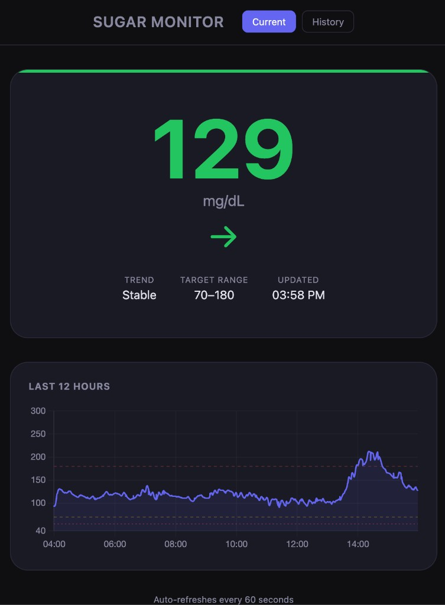
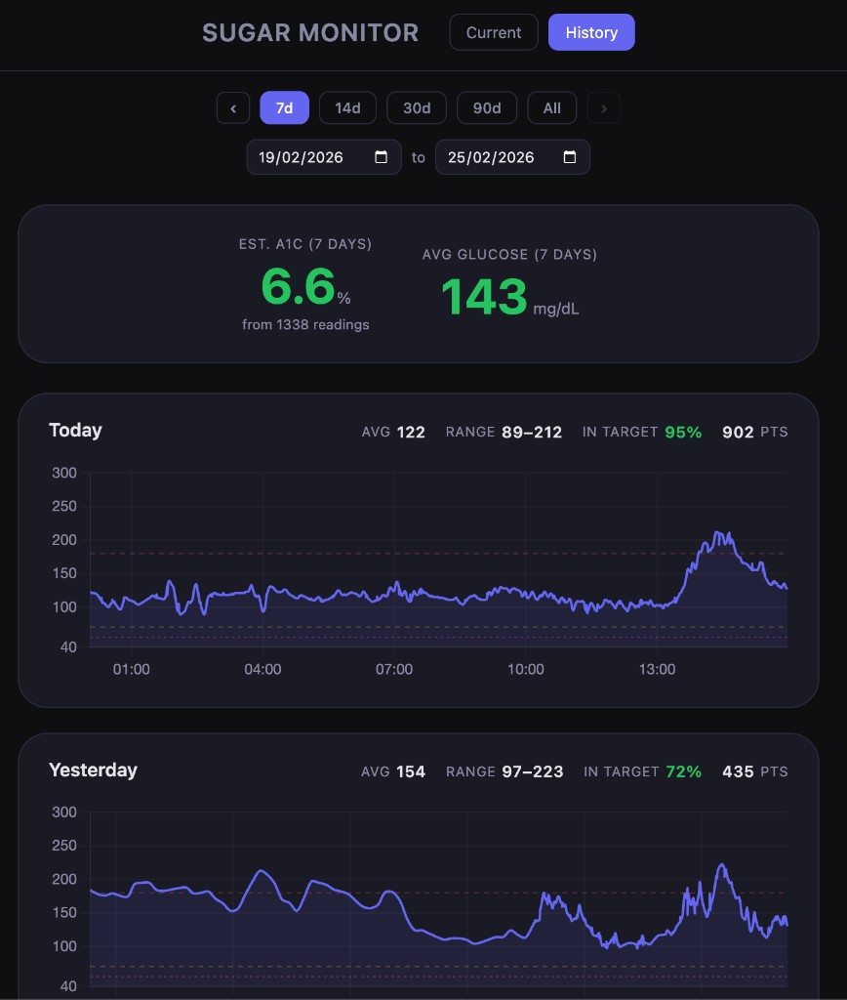

# Sugar Monitor

A web app that displays your current glucose level from LibreLinkUp.

| Current | History |
|---------|---------|
|  |  |

## Prerequisites: LibreLinkUp Setup

This app reads glucose data through the **LibreLinkUp** API. Before you can use it,
you need a LibreLinkUp account that is connected to a FreeStyle Libre sensor wearer.

### Step 1 — Sensor wearer sends an invitation

The person wearing the FreeStyle Libre sensor must share their data with you
(or with yourself, if you are both the wearer and the one running this app):

1. Open the **FreeStyle Libre** app on the sensor wearer's phone.
2. Make sure you are logged into your **LibreView** account (the app will prompt
   you to create one if you haven't already).
3. Tap the **menu** (☰) → **Share** (or **Connected Apps**).
4. Tap **Connect** / **Manage** under **LibreLinkUp**.
5. Tap **Add Connection** and enter the name and email address of the person
   who will run this app.

### Step 2 — Accept the invitation in LibreLinkUp

1. Check the email inbox for the address entered above — you should receive an
   invitation from LibreLinkUp.
2. Click the link in the email and download the **LibreLinkUp** app
   (iOS / Android).
3. Create a LibreLinkUp account using the **same email** that received the
   invitation. Choose your **country** during signup — this determines your
   region (see below).
4. Verify your email when prompted.
5. Open LibreLinkUp and **accept** the pending connection.

You should now see live glucose readings inside the LibreLinkUp app.
The email and password you used to create this account are the credentials
this app needs.

### Step 3 — Configure the `.env` file

```bash
cp .env.example .env
```

Edit `.env` with your values:

```
LIBRE_EMAIL=your_librelinkup_email@example.com
LIBRE_PASSWORD=your_librelinkup_password
LIBRE_REGION=EU
```

`LIBRE_REGION` must match the region you selected when creating your
LibreLinkUp account. Available values:

| Code | Region |
|------|--------|
| `US` | United States |
| `EU` | Europe |
| `EU2` | Europe (secondary) |
| `DE` | Germany |
| `FR` | France |
| `AU` | Australia |
| `CA` | Canada |
| `JP` | Japan |
| `AP` | Asia-Pacific |
| `AE` | United Arab Emirates |
| `LA` | Latin America |

If you are unsure which region to use, it is the one matching the country you
chose during LibreLinkUp account creation. For example, Israel uses `EU`.

## Install

```bash
uv sync
```

## Run

```bash
uv run uvicorn app.main:app --reload
```

Then open http://localhost:8000.

## Tests

Install test dependencies:

```bash
uv sync          # includes Python dev dependencies (pytest, pytest-cov, etc.)
npm install      # installs Vitest for JavaScript tests
```

Python tests (with verbose output and coverage):

```bash
uv run pytest -v --cov=app --cov-report=term-missing
```

JavaScript tests (with verbose output):

```bash
npx vitest run --reporter=verbose
```

## Type checking

```bash
uv run mypy app/
```
